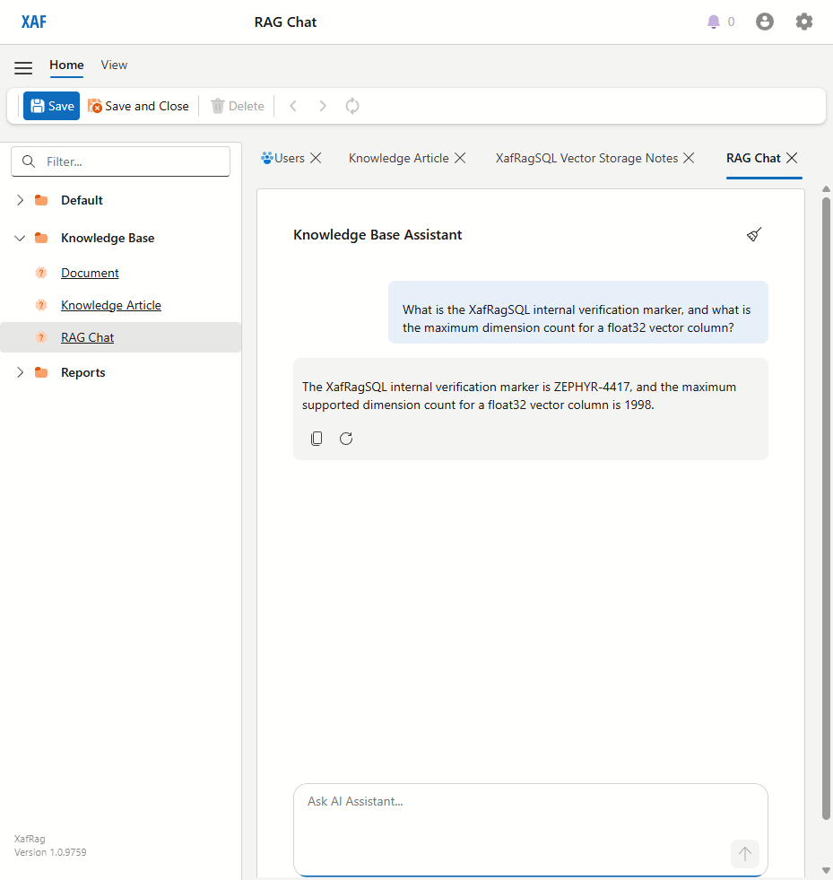
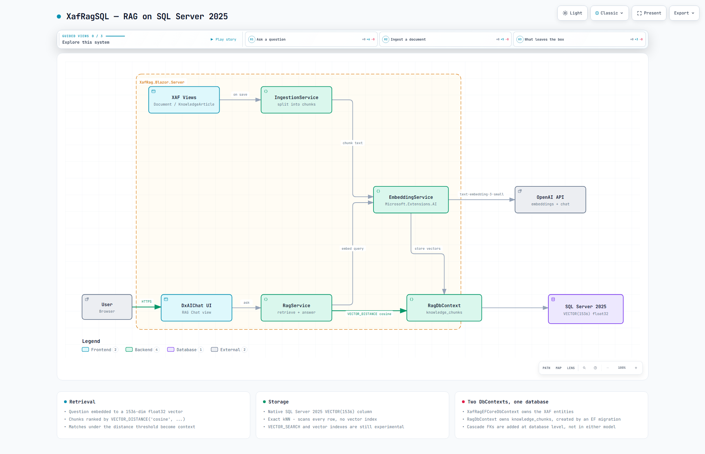

# XafRagSQL — RAG Sample for DevExpress XAF on SQL Server 2025


*RAG Chat answering from an ingested article — retrieved via `VECTOR_DISTANCE` over a native SQL Server 2025 `VECTOR(1536)` column.*


*How the pieces fit. `docs/architecture.html` is the same diagram as an interactive page — clone and open it in a browser for guided views, search and relationship tracing (GitHub shows it as source, not a page).*

XafRagSQL is a tutorial and reference implementation showing how to add Retrieval-Augmented Generation (RAG) to a [DevExpress XAF](https://www.devexpress.com/products/net/application_framework/) Blazor Server application. It stores and queries vector embeddings in **SQL Server 2025's native `VECTOR` type** through EF Core 10's built-in support, uses OpenAI to generate embeddings and LLM responses, and the DevExpress `DxAIChat` component for a polished in-app chat interface — all wired together through `Microsoft.Extensions.AI` abstractions.

> Ported from [XafRag](https://github.com/MBrekhof/xafrag), which does the same thing on PostgreSQL + PGVector. The point of this variant: the knowledge base lives in the same SQL Server database as the business data, so no second database engine is needed to add RAG to an existing XAF app.

---

## Tech Stack

| Layer | Technology |
|---|---|
| Framework | .NET 10, DevExpress XAF 26.1.4 |
| UI | Blazor Server, DevExpress DxAIChat 26.1.4 |
| ORM | EF Core 10 |
| Vector store | SQL Server 2025 native `VECTOR(1536)` (EF Core 10 `SqlVector<float>`) |
| AI | OpenAI `text-embedding-3-small` (embeddings), `gpt-4o` (chat) |
| AI abstractions | `Microsoft.Extensions.AI` 10.8.0 |
| Document parsing | DevExpress Document Processor (PDF, DOCX), plain text (TXT, MD) |
| Logging | Serilog (console + rolling file) |

---

## Prerequisites

- [.NET 10 SDK](https://dotnet.microsoft.com/download/dotnet/10.0)
- [Docker Desktop](https://www.docker.com/products/docker-desktop/) (for SQL Server 2025)
- **SQL Server 2025 or later is required** — the `VECTOR` type does not exist in earlier versions and there is no downgrade path
- DevExpress license (26.1.4 or later in the 26.1 line) with the DevExpress NuGet feed configured
- OpenAI API key

---

## Quick Start

1. **Clone the repository**

   ```bash
   git clone https://github.com/your-org/xafrag.git
   cd xafrag
   ```

2. **Start SQL Server 2025**

   ```bash
   docker compose up -d
   ```

   This starts a `mcr.microsoft.com/mssql/server:2025-latest` container (Developer edition) on port 14333. The `XafRagSQL` database and the `knowledge_chunks` table are created on first run by the `RagDbContext` migration.

3. **Set your OpenAI API key**

   Add your key to `appsettings.Development.json` (gitignored):

   ```json
   {
     "OpenAI": {
       "ApiKey": "sk-your-key-here"
     }
   }
   ```

4. **Run the application**

   ```bash
   dotnet run --project XafRag/XafRag.Blazor.Server
   ```

   On first run, XAF creates all database tables automatically (including the `knowledge_chunks` vector table).

5. **Log in**

   Open `https://localhost:5001` and log in as **Admin** with an empty password.

6. **Add knowledge**

   Navigate to **Knowledge Base > Document** and upload files. Supported formats: `.txt`, `.md`, `.pdf`, `.docx`. The file name is captured automatically from the upload. Each document is chunked, embedded, and stored in the `knowledge_chunks` vector column in the background.

   Alternatively, navigate to **Knowledge Base > Knowledge Article** and write articles directly. They are ingested on save.

   Sample documents covering .NET, Blazor, EF Core, XAF, and the Dark Forest theory are included in the `docs/` folder — upload them to get started quickly.

7. **Chat**

   Navigate to **Knowledge Base > RAG Chat** and ask questions. The assistant retrieves relevant chunks from your knowledge base and generates a grounded response. Each chunk is passed to the model labelled with its source document and chunk position (`**[Part 2 of "ef-core-querying.md"]**`), and the system prompt asks it to name the source it used — whether it actually does so on any given answer is up to the model. Use the **Clear Chat** button in the header to start a new conversation.

---

## How the vector search works

`KnowledgeChunk.Embedding` is an EF Core 10 `SqlVector<float>?` mapped to a native `vector(1536)`
column. `RagService.SearchAsync` projects the distance into a DTO and then filters and orders on it:

```csharp
.Select(k => new SearchResult {
    Distance = EF.Functions.VectorDistance("cosine", k.Embedding!.Value, queryVector), ... })
.Where(r => r.Distance <= threshold)
.OrderBy(r => r.Distance)
.Take(maxResults)
```

EF flattens that projection, so it translates to a single statement with no subquery:

```sql
-- captured from the running application
SELECT TOP(@p) [k].[content] AS [Content],
       VECTOR_DISTANCE('cosine', [k].[embedding], @queryVector) AS [Distance],
       [k].[chunk_index] AS [ChunkIndex], [k].[source_type] AS [SourceType],
       [k].[knowledge_article_id] AS [KnowledgeArticleId], [k].[document_id] AS [DocumentId]
FROM [knowledge_chunks] AS [k]
WHERE VECTOR_DISTANCE('cosine', [k].[embedding], @queryVector) <= @_options_DistanceThreshold
ORDER BY VECTOR_DISTANCE('cosine', [k].[embedding], @queryVector)
```

`@queryVector` binds as a 6152-byte binary parameter: 1536 float32 values plus an 8-byte header.

**This is an exact kNN search — it scans every row.** That is deliberate: SQL Server 2025's
`VECTOR_SEARCH()` and vector indexes are experimental and their EF APIs are documented as subject
to change. At POC volumes the scan is fine. The upgrade path, when the row count justifies it, is
`HasVectorIndex()` plus `VectorSearch(...).WithApproximate()`.

Other constraints worth knowing: `vector` columns cap at **1998 dimensions** for float32 (so
`text-embedding-3-small` at 1536 fits, `text-embedding-3-large` at 3072 does not), and they support
no constraints, no Always Encrypted and no memory-optimized tables.

## Project Structure

```
xafrag/
├── docker-compose.yml                        # SQL Server 2025 (port 14333)
├── docs/                                     # Sample documents for demo upload
│   ├── blazor-components.md
│   ├── blazor-fundamentals.md
│   ├── dark-forest-theory.md
│   ├── dotnet-rag-quickstart.md
│   ├── ef-core-getting-started.md
│   ├── ef-core-querying.md
│   ├── ef-core-relationships.md
│   ├── fermi-paradox.md
│   ├── xaf-crud-operations.md
│   ├── xaf-security-passwords.md
│   ├── how_to_implement.md                   # Step-by-step implementation guide
│   ├── architecture.spec.json               # Archify source for the diagram
│   ├── architecture.html                    # Explorable diagram (open in a browser)
│   └── architecture.png                     # Rendered diagram, embedded above
├── XafRag/
│   ├── XafRag.Module/
│   │   └── BusinessObjects/
│   │       ├── KnowledgeArticle.cs           # XAF entity (title + content)
│   │       ├── Document.cs                   # XAF entity (file upload, auto filename)
│   │       ├── DocumentStatus.cs             # Pending → Processing → Completed/Failed
│   │       ├── RagChatHolder.cs              # Non-persistent object backing the chat view
│   │       ├── KnowledgeChunk.cs             # EF Core entity with vector(1536) column
│   │       ├── ChunkSourceType.cs            # Article or Document enum
│   │       ├── RagDbContext.cs               # Separate DbContext for vector operations
│   │       └── XafRagDbContext.cs            # XAF-managed EF Core DbContext
│   └── XafRag.Blazor.Server/
│       ├── Configuration/
│       │   ├── OpenAiOptions.cs              # API key + model names
│       │   └── RagOptions.cs                 # Chunk size, overlap, search thresholds
│       ├── Controllers/
│       │   ├── KnowledgeArticleIngestionController.cs
│       │   ├── DocumentIngestionController.cs
│       │   └── RagChatWindowController.cs    # Redirects ListView → DetailView for chat
│       ├── Editors/
│       │   ├── RagChatViewItem.cs            # Custom XAF ViewItem (IComponentContentHolder)
│       │   └── RagChatComponent.razor        # DxAIChat wrapper with Markdown rendering
│       ├── Services/
│       │   ├── ChunkingService.cs            # Paragraph-aware text splitter
│       │   ├── EmbeddingService.cs           # Wraps IEmbeddingGenerator
│       │   ├── DocumentProcessingService.cs  # PDF/DOCX/TXT/MD text extraction
│       │   ├── IngestionService.cs           # Background ingestion with status tracking
│       │   └── RagService.cs                 # Vector search + source resolution + LLM streaming
│       ├── RagChatDetailViewUpdater.cs       # Programmatic model layout for chat view
│       ├── BlazorModule.cs                   # Registers the detail view updater
│       ├── Startup.cs                        # DI wiring
│       ├── Program.cs                        # Serilog configuration
│       └── appsettings.json                  # Configuration (API key in Development.json)
```

---

## How It Works

### Ingestion pipeline

When a `KnowledgeArticle` is saved or a `Document` is uploaded, an XAF `ViewController` fires after `ObjectSpace.Committed`. The document status moves to **Processing** and the `IngestionService` runs the pipeline on a background thread:

```
Upload document / Save article
  → DocumentProcessingService  — extract text from PDF/DOCX/TXT/MD
  → ChunkingService            — split into ~500-token paragraphs with 100-token overlap
  → EmbeddingService           — call OpenAI text-embedding-3-small → float[1536] vectors
  → RagDbContext               — delete old chunks, insert new KnowledgeChunk rows
  → Update Document.Status     — Completed or Failed
```

### Retrieval pipeline

When the user sends a message in the RAG Chat:

```
User question
  → EmbeddingService           — embed the question (same model)
  → RagDbContext               — cosine distance search via VECTOR_DISTANCE, top 5 under threshold
  → Source resolution           — resolve document filenames / article titles
  → RagService                 — build system prompt: "[Part N of "filename.md"] chunk text..."
  → OpenAI gpt-4o              — streaming chat response
  → DxAIChat                   — render the Markdown answer in the browser
```

---

## Configuration

All configuration lives in `appsettings.json`. The OpenAI API key should be placed in `appsettings.Development.json` (gitignored).

```json
"OpenAI": {
  "ApiKey": "",
  "EmbeddingModel": "text-embedding-3-small",
  "ChatModel": "gpt-4o"
},
"Rag": {
  "ChunkTokenLimit": 500,
  "ChunkOverlap": 100,
  "MaxResults": 5,
  "DistanceThreshold": 1.0
}
```

| Setting | Description |
|---|---|
| `OpenAI:ApiKey` | Your OpenAI API key (use `appsettings.Development.json`) |
| `ChunkTokenLimit` | Maximum estimated tokens per chunk (1 token ~ 4 characters) |
| `ChunkOverlap` | Overlap in tokens carried from the previous chunk |
| `MaxResults` | Maximum chunks returned by vector search |
| `DistanceThreshold` | Cosine distance ceiling — chunks beyond this are excluded |

---

## Logging

Serilog writes to both the console and rolling log files at `logs/xafrag-YYYY-MM-DD.log`. The ingestion pipeline logs every step (text extraction, chunking, embedding, saving) so you can diagnose issues without a debugger.

---

## Sample Documents

The `docs/` folder contains 10 ready-to-upload documents covering three domains:

| Domain | Documents |
|---|---|
| .NET / Blazor / EF Core | `ef-core-getting-started.md`, `ef-core-querying.md`, `ef-core-relationships.md`, `blazor-fundamentals.md`, `blazor-components.md`, `dotnet-rag-quickstart.md` |
| DevExpress XAF | `xaf-security-passwords.md`, `xaf-crud-operations.md` |
| Cosmology / Sci-Fi | `dark-forest-theory.md`, `fermi-paradox.md` |

Upload these through the Document view to populate the knowledge base and test cross-domain retrieval.

---

## Future Extensions

- **Web search** — integrate Tavily, Bing, or OpenAI Responses API for answers beyond the knowledge base
- **Hybrid search** — combine BM25 full-text search with vector search and re-rank results
- **Query expansion** — generate multiple query variants to improve recall
- **Chat history persistence** — store conversation threads in the database
- **Background job queue** — replace fire-and-forget `Task.Run` with Hangfire for reliable ingestion

---

## Implementation Guide

See [docs/how_to_implement.md](docs/how_to_implement.md) for a step-by-step guide on adding RAG to your own XAF application.

---

## License

MIT
